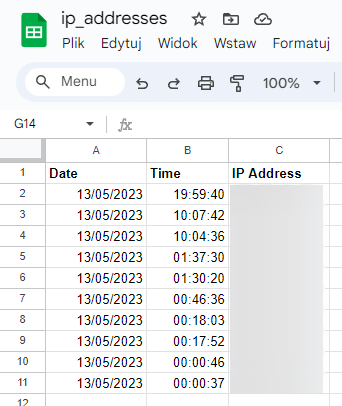

# ip-addresses
The script retrieves the IP interior from https://ident.me then connects to the [Google Sheets API](https://developers.google.com/sheets/api/guides/concepts "Google Sheets API Overview") and adds the current computer address to the sheet.
This simple application was created for **Wake On Lan** purposes. My ISP assigns a dynamic IP address so waking up the computer remotely may not necessarily work in this case. However, having a list of the last IP used seems possible, at least for the *lease time* period set by the ISP.
Finally, a script trigger was set using Task Scheduler, which launches the application when the sleep button on the laptop is clicked.

Final result:



## Table of contents
* [How to configure Wake On Lan](#How-to-configure-Wake-On-Lan)
* [Google Sheets API connection](#Google-Sheets-API-connection)
* [Windows Task Scheduler](#Google-Sheets-API-connection)
* [License](#License)

## How to configure Wake On Lan
In order to set up Wake On Lan on your computer, you need to:
1. Change the settings for the network card and enable wake on lan option
⋅⋅⋅
2. In many cases, you should also go to the BIOS and activate such functionality from there as well
4. Add *port forwarting* to the router on port 3389 and/or 3390.
⋅⋅⋅If you want to not only start your computer remotely but also use it via Remote Desktop Connection, you need to set Port Forwarting on your router. When you use a remote desktop client to connect to your personal computer (PC), you are establishing a peer-to-peer connection. The host (your PC) must therefore be directly accessible to you. If you want to connect to your system from outside the network it is running on, you must somehow enable the access. 

```diff
- Please be mindful when enabling port forwarding on 3389 as your computer is getting exposed to the external network and might be a target of hackers attack
```


Also please check if you have enabled Remote Desktop Connections [Enable Remote Desktop on your PC](https://learn.microsoft.com/en-us/windows-server/remote/remote-desktop-services/clients/remote-desktop-allow-access)

Some resource for Wake On Lan instruction: [How to activate Wake On Lan in Windows 10 and 11](https://www.revouninstaller.com/blog/how-to-activate-wake-on-lan-in-windows-10-and-11)

Explenation of risk related to the 3389 port forwarding: [Remote Desktop Penetration Testing](https://www.hackingarticles.in/remote-desktop-penetration-testing-port-3389/)

```
fb_word_cloud.py -p C:\fb\messages\inbox\username_xzdsmlmbaiw\
```


Generate rectangular Word Cloud without specified words:
```
fb_word_cloud.py -p C:\fb\messages\inbox\username\ -e a,in,an,or,and,how,why 
```

Generate Word Cloud in different shapes (see [Custom shape](#Custom-shape) ) without specified words :
```
fb_word_cloud.py -p C:\fb\messages\inbox\username\ -e a,in,an,or,and,how,why -i C:\Users\Desktop\like.jpg
```

## Google Sheets API connection
In order to create Word Cloud in various shapes, mask need to be provided in in a certain way. Script accepts only files with `.jpg`, `.jpeg` and `.png` extensions. Additionally, file need to have black `#000000` shape and white `#FFFFFF` background. For .png files background can be transparent.
<p float="left">
     </img>
  
</p>

## Downloading messages files
If you don't know how to download facebook archive, below you can find step by step manual.

1. Click on you profile picture and select **Setting & Privacy** ⮕ **Settings**
<p float="left">
    ⮕  </img>
  
</p>
<br/>

2. On the left side of the screen click **Privacy** tab and then **Your Facebook information**
<p float="left">
    ⮕  </img>
  
</p>
<br/>

3. You will have a list of options to choose from, please select **Download profile information**

<br/>
