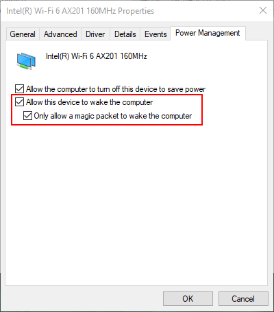
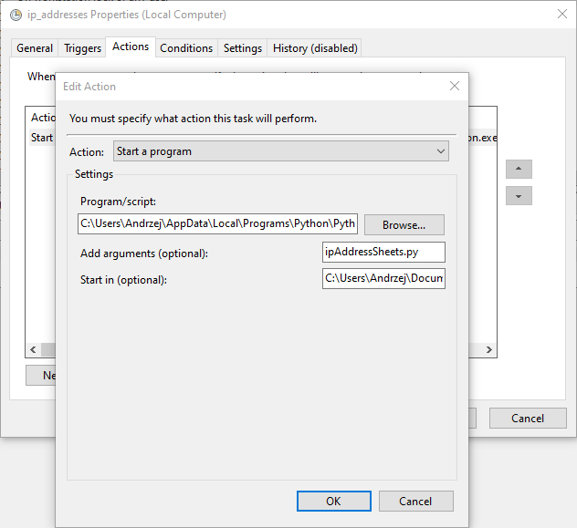
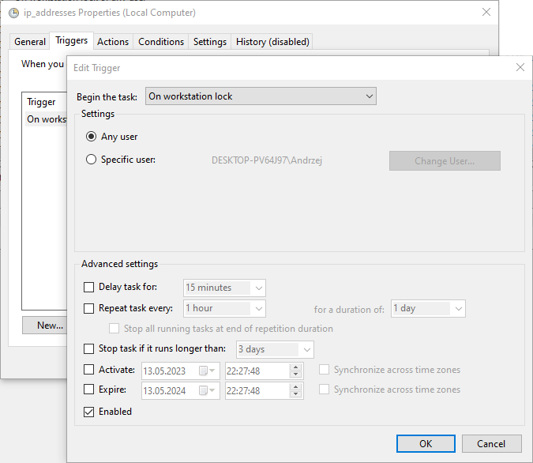

# Save external IP address to the Google Sheets
The script retrieves the IP interior from https://ident.me then connects to the [Google Sheets API](https://developers.google.com/sheets/api/guides/concepts "Google Sheets API Overview") and adds the current computer address to the sheet.
This simple application was created for **Wake On Lan** purposes. My ISP assigns a dynamic IP address so waking up the computer remotely may not necessarily work in this case. However, having a list of the last IP used seems possible, at least for the *lease time* period set by the ISP.
Finally, a script trigger was set using Task Scheduler, which launches the application when the sleep button on the laptop is clicked.

Final result:</br>


## Table of contents
* [How to configure Wake On Lan](#How-to-configure-Wake-On-Lan)
* [Google Sheets API connection](#Google-Sheets-API-connection)
* [Windows Task Scheduler](#Google-Sheets-API-connection)
* [License](#License)

## How to configure Wake On Lan
In order to set up Wake On Lan on your computer, you need to:
1. Change the settings for the network card and enable wake on lan option
   - 
2. In many cases, you should also go to the BIOS and activate such functionality from there as well
3. Add *port forwarting* to the router on port `3389`
   - If you want to not only start your computer remotely but also use it via Remote Desktop Connection, you need to set Port Forwarting on your router. When you use a remote desktop client to connect to your personal computer (PC), you are establishing a peer-to-peer connection. The host (your PC) must therefore be directly accessible to you. If you want to connect to your system from outside the network it is running on, you must somehow enable the access. 

```diff
- Please be mindful when enabling port forwarding on 3389 as your computer is 
- getting exposed to the external network and might be a target of hackers attack!
```


Also please check if you have enabled Remote Desktop Connections [Enable Remote Desktop on your PC](https://learn.microsoft.com/en-us/windows-server/remote/remote-desktop-services/clients/remote-desktop-allow-access)

Some resource for Wake On Lan instruction: [How to activate Wake On Lan in Windows 10 and 11](https://www.revouninstaller.com/blog/how-to-activate-wake-on-lan-in-windows-10-and-11)

Explenation of risk related to the 3389 port forwarding: [Remote Desktop Penetration Testing](https://www.hackingarticles.in/remote-desktop-penetration-testing-port-3389/)


## Google Sheets API connection
I think here ia a good explenation what needs to be enabled and configured to have Google API working: [Enable Google Sheets API](https://mljar.com/blog/authenticate-python-google-sheets-service-account-json-credentials/)
Remember that you need two APIs enabled: Google Sheets and Google Drive. This is how it is reflected in the code:

```python
SCOPES = ['https://www.googleapis.com/auth/spreadsheets',
          'https://www.googleapis.com/auth/drive']
```

## Windows Task Scheduler
The final step is to configure the Task Scheduler. All you need to do is create a new task and add a trigger. 
</br>
* In `Program/Script` input paste the exact path to the python.exe application on your computer. You can find it easliy by typing in `cmd` command 
```powershell
where python
```
* In `Add arguments (optional)` input provide the name of the file with the python script to run
* In `Start in (optional)` input provide the path to the folder with the script
</br>


As a trigger for a task select **On workstation lock**, so each time you press power button on the laptop (sleep mode) you script will be triggered.
</br>

